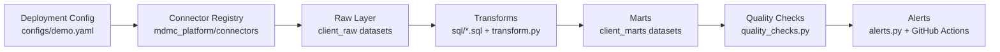

[](https://github.com/madison-crowley/mdmc-reporting-demo/actions/workflows/pipeline.yml)

# MDMC Managed-Reporting Platform

This repository is the public demo deployment of the actual config-driven reporting platform MDMC deploys and runs for clients.

It is designed for multi-source marketing and operations reporting: web analytics, ad platforms, and booking systems land in BigQuery, are transformed into decision-ready marts, are checked nightly for quality, and are monitored with automated alerts. MDMC builds the system, owns the runbook, and manages it after launch.

This repo is not a throwaway sample. It is the public-facing deployment of the same platform pattern behind MDMC’s build-then-manage service.

## What This Is

MDMC deploys this platform per client:

- configuration defines the deployment
- connectors standardize source extracts
- raw datasets land in BigQuery
- transforms build marts for dashboarding and operations
- quality checks monitor freshness, anomalies, and reconciliation drift
- orchestration runs nightly
- alerting routes issues before reporting breaks quietly

The deployment included here is the public demo config at `configs/demo.yaml`.

## What Is In This Demo

This public repository uses only public or synthetic data:

- Google’s public GA4 sample dataset from BigQuery
- clearly labeled synthetic ad-platform feeds
- clearly labeled synthetic booking-system feeds

No client data is present in this repository.

The synthetic feeds are intentional. They are calibrated to show the two reporting problems most buyers already feel in practice:

1. Ad platforms and analytics never agree.
The reconciliation mart quantifies the gap between platform-reported conversions and analytics-side purchases instead of hiding it.

2. Attribution leakage makes booked revenue hard to tie back to spend.
The booking funnel mart crosses paid media, analytics sessions, bookings, completions, and revenue into one daily operating view.

## How A Client Deployment Differs

Each real client deployment keeps the same platform core but swaps in client-specific settings and live systems:

- a private config instead of the public demo config
- live Meta / Google Ads connectors instead of demo synthetic ad feeds
- live Square / Mindbody / other booking or POS connectors instead of demo synthetic booking feeds
- the client’s BigQuery project and dataset namespace
- the client’s alert routing, GitHub issue policy, and Slack webhook exposure

The public repo stays honest about the difference: the code pattern is real, the deployment config is public, and the data in this repo is demo-safe.

## Architecture



The architecture is intentionally config-driven:

- config determines the deployment
- connectors determine how sources are materialized
- SQL expresses business logic
- Python handles execution, validation, and orchestration

That makes it practical to deploy the same platform shape repeatedly without rebuilding the core for every client.

## How It Runs

The main entrypoint is `scripts/run_pipeline.py`.

A full run does the following:

1. Load the selected deployment config
2. Run configured connectors into `<dataset_prefix>_raw`
3. Build marts in `<dataset_prefix>_marts`
4. Execute quality checks
5. Write `artifacts/quality_report.json`
6. Let GitHub Actions upload the report and dispatch alerts

## Local Setup

Required environment variables:

- `GCP_PROJECT_ID`
- `GCP_SA_KEY` as raw service-account JSON

Typical setup:

```powershell
python -m venv .venv
.\.venv\Scripts\python.exe -m pip install -r requirements.txt
```

## Local Commands

Run the full pipeline:

```powershell
.\.venv\Scripts\python.exe scripts\run_pipeline.py --config configs/demo.yaml --step all
```

Run individual stages:

```powershell
.\.venv\Scripts\python.exe scripts\run_pipeline.py --config configs/demo.yaml --step extract
.\.venv\Scripts\python.exe scripts\run_pipeline.py --config configs/demo.yaml --step transform
.\.venv\Scripts\python.exe scripts\run_pipeline.py --config configs/demo.yaml --step checks
```

Dry-run lint the rendered BigQuery SQL:

```powershell
.\.venv\Scripts\python.exe scripts\lint_sql.py --config configs/demo.yaml
```

## Nightly Orchestration

The reusable deployment workflow is `.github/workflows/pipeline.yml`.

It runs:

- nightly at `07:00 UTC`
- manually via `workflow_dispatch`

The workflow accepts a config path input, defaulting to `configs/demo.yaml`, so the workflow is deployment-oriented rather than demo-specific.

Each run:

- checks out the repo
- sets up Python 3.11 with pip cache
- installs dependencies
- runs `scripts/run_pipeline.py --config <input> --step all`
- uploads `artifacts/quality_report.json`
- dispatches GitHub and Slack alerting from the config’s `alerts` block

## Alerting

Alerting is driven by the `alerts` block in each deployment config.

Behavior:

- on pipeline failure, CRITICAL failure, or WARN items, create or update a GitHub issue labeled `pipeline-alert`
- if `alerts.slack_webhook_env` names an exposed environment variable and that variable is set, send a compact Slack summary
- on a fully clean run, close open `pipeline-alert` issues for that client with a resolution comment

The public demo config keeps GitHub issue alerting off and does not set a Slack webhook by default.

## Adding A New Deployment

To add a deployment:

1. Add a new YAML config
2. Point the workflow `config_path` input at that config
3. Expose the required GCP and alerting secrets/env vars
4. If the source mix is new, add and register a connector

In the normal case, a new deployment should mean new config and connector selection, not core-platform rewrites.

## Continuous Integration

Pull requests run `.github/workflows/ci.yml`, which:

- runs `pytest`
- performs a BigQuery dry-run lint pass against the rendered SQL

This gives fast feedback on both Python behavior and warehouse-query validity before deployment changes ship.

---

Built and maintained by [MDMC](https://marinodmc.com). This is the system behind our build-then-manage managed-reporting service.
