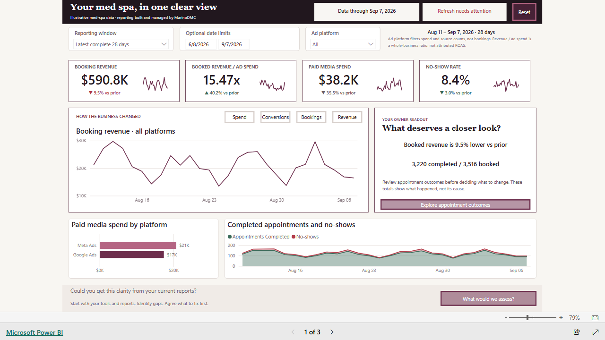
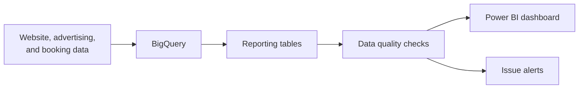

# MDMC Managed Reporting Demo

See which marketing efforts are bringing in bookings and revenue without piecing together reports from several tools. MDMC brings website, advertising, and booking data together, updates and checks the reporting data every night, and flags problems that need attention.

[View the live dashboard →](https://app.powerbi.com/view?r=eyJrIjoiNjljMzcyYmUtZmFmZi00ZDI0LThjZGItNGY3ZjA1YjBiYTA1IiwidCI6IjZlZDU5N2Y4LTJmYTUtNGJkMC1hNjQzLWYwMDUxNGI5YWNjNCIsImMiOjF9&pageName=overview)

> This demo uses public and synthetic data. It does not contain customer data.

## What the Demo Shows

The dashboard helps an owner see:

- which marketing efforts are contributing to bookings and revenue
- where advertising and website numbers disagree
- how visits move through the booking journey
- which reporting issues need attention

The public demo combines Google’s public GA4 sample data with clearly labeled synthetic advertising and booking data. No client data is included.

## How a Client Deployment Differs

A client deployment follows the same reporting flow but replaces the demo inputs with live business systems. It uses private client settings, a client-specific data environment, and agreed alert channels. Client data remains outside this public repository.

## How It Works

```mermaid
flowchart LR
    A["Website, advertising,<br/>and booking data"] --> B["BigQuery"]
    B --> C["Reporting tables"]
    C --> D["Data quality checks"]
    D --> E["Power BI dashboard"]
    D --> F["Issue alerts"]
```

The data pipeline runs nightly to gather and prepare reporting data, run quality checks, and flag issues. Power BI refresh is managed separately from the scheduled data pipeline.

## About the Demo Data

The demo is designed to show the reporting experience, not to support real business decisions:

- The GA4 sample identifies first-user acquisition rather than session-level campaign attribution.
- Google’s public ecommerce sample is intentionally obfuscated and has limited internal consistency.
- Advertising and booking feeds are synthetic and shaped for demonstration purposes.

## For Developers

See the [development guide](docs/development.md) for local setup, pipeline commands, nightly orchestration, alerting, continuous integration, and deployment configuration.

---

Built and maintained by [MDMC](https://marinodmc.com). This is the system behind our build-then-manage managed-reporting service.
